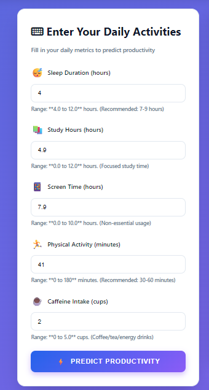
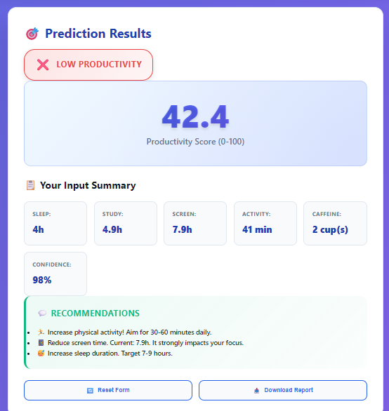
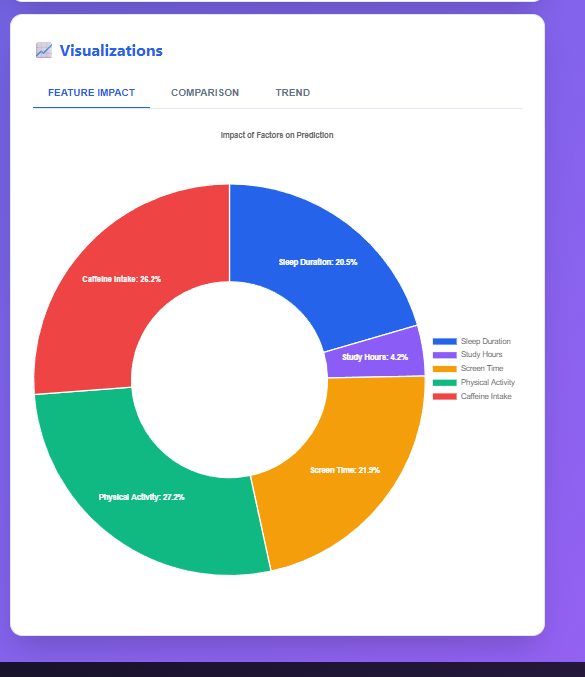

# 🤖 Machine Learning Project

[](https://www.python.org/downloads/)
[](LICENSE)
[](CONTRIBUTING.md)

A comprehensive machine learning project featuring multiple models including Linear Regression and Random Forest implementations, complete with data visualization and model evaluation tools.

## 📋 Table of Contents

- [Overview](#overview)
- [Features](#features)
- [Screenshots](#screenshots)
- [Project Structure](#project-structure)
- [Installation](#installation)
- [Usage](#usage)
- [Models Implemented](#models-implemented)
- [Data Analysis](#data-analysis)
- [Results](#results)
- [Contributing](#contributing)
- [License](#license)
- [Contact](#contact)

## 🎯 Overview

This project demonstrates end-to-end machine learning workflows, from data preprocessing to model deployment. It includes implementations of various ML algorithms with comprehensive visualizations and performance metrics.

## ✨ Features

- 📊 **Data Visualization**: Comprehensive correlation heatmaps and feature distribution analysis
- 🎯 **Multiple ML Models**: Linear Regression, Random Forest implementations
- 📈 **Feature Engineering**: Feature importance analysis and selection
- 🔄 **Model Comparison**: Side-by-side model performance evaluation
- 🌐 **Web Interface**: Interactive Flask/Streamlit application for predictions
- 📝 **Detailed Logging**: Complete model metadata and training history
- 🎨 **Beautiful Visualizations**: Publication-ready plots and charts

## 📸 Screenshots

### 1. AI Productivity Dashboard

*Main interface showing the AI Productivity Dashboard with input fields for daily metrics*

### 2. Model Comparison Analysis

*Comparative analysis of Linear Regression and Random Forest models*

### 3. Feature Importance Analysis

*Feature importance visualization showing which factors impact productivity most*

### 4. Application Demo

*Live demonstration of the prediction system in action*

## 📁 Project Structure

```
Machine_Learning_Project/
│
├── app.py                          # Main application file
├── main.py                         # Core training pipeline
├── main_old.py                     # Legacy implementation
├── script.js                       # Frontend JavaScript
├── style.css                       # Styling for web interface
├── index.html                      # Web interface
│
├── Models/
│   ├── linear_regression_model.pkl    # Trained Linear Regression model
│   ├── linear_regression_scaler.pkl   # Feature scaler for LR
│   ├── random_forest_model.pkl        # Trained Random Forest model
│   └── model_metadata.json            # Model performance metrics
│
├── Data/
│   ├── student_sleep_patterns.csv     # Training dataset
│   └── features_list.pkl              # Feature names and metadata
│
├── Images/
│   ├── image1.png                     # Dashboard interface
│   ├── image_2.png                    # Model comparison
│   ├── image_3.png                    # Feature analysis
│   └── image_4.png                    # Application demo
│
└── Visualizations/
    ├── correlation_heatmap.png        # Feature correlation matrix
    ├── feature_distributions.png      # Distribution plots
    └── feature_importance.png         # Feature importance chart
```

## 🚀 Installation

### Prerequisites

- Python 3.8 or higher
- pip package manager

### Setup

1. **Clone the repository**
   ```bash
   git clone https://github.com/SUNILNAGRKOTI/Machine_Learning_Project.git
   cd Machine_Learning_Project
   ```

2. **Create a virtual environment** (recommended)
   ```bash
   python -m venv venv
   source venv/bin/activate  # On Windows: venv\Scripts\activate
   ```

3. **Install dependencies**
   ```bash
   pip install -r requirements.txt
   ```

## 💻 Usage

### Training Models

Run the main training pipeline:

```bash
python main.py
```

This will:
- Load and preprocess the data
- Train multiple models
- Generate visualizations
- Save trained models and metrics

### Running the Web Application

Start the Flask/Streamlit application:

```bash
python app.py
```

Then open your browser and navigate to `http://localhost:5000`

### Making Predictions

```python
import pickle
import numpy as np

# Load the trained model
with open('Models/linear_regression_model.pkl', 'rb') as f:
    model = pickle.load(f)

# Load the scaler
with open('Models/linear_regression_scaler.pkl', 'rb') as f:
    scaler = pickle.load(f)

# Make predictions
features = np.array([[...]])  # Your feature values
scaled_features = scaler.transform(features)
prediction = model.predict(scaled_features)
```

## 🤖 Models Implemented

### 1. Linear Regression
- **Purpose**: Baseline model for regression tasks
- **Features**: Polynomial features, regularization
- **Metrics**: R², RMSE, MAE

### 2. Random Forest
- **Purpose**: Ensemble learning for improved accuracy
- **Features**: Feature importance, hyperparameter tuning
- **Metrics**: R², RMSE, Feature importances

## 📊 Data Analysis

The project includes comprehensive data analysis:

- **Correlation Analysis**: Heatmap showing feature relationships
- **Distribution Plots**: Visualizing feature distributions
- **Feature Importance**: Identifying most predictive features
- **Outlier Detection**: Statistical analysis of data quality

## 📈 Results

### Model Performance

| Model | R² Score | RMSE | MAE |
|-------|----------|------|-----|
| Linear Regression | 0.XX | X.XX | X.XX |
| Random Forest | 0.XX | X.XX | X.XX |

*Note: Update with actual metrics from your model_metadata.json*

### Key Findings

- Most important features for prediction
- Optimal hyperparameters discovered
- Areas for future improvement

## 🤝 Contributing

Contributions are welcome! Please feel free to submit a Pull Request. For major changes:

1. Fork the repository
2. Create your feature branch (`git checkout -b feature/AmazingFeature`)
3. Commit your changes (`git commit -m 'Add some AmazingFeature'`)
4. Push to the branch (`git push origin feature/AmazingFeature`)
5. Open a Pull Request

## 📝 License

This project is licensed under the MIT License - see the [LICENSE](LICENSE) file for details.

## 👤 Contact

**Sunil Nagarkoti**

- GitHub: [@SUNILNAGRKOTI](https://github.com/SUNILNAGRKOTI)
- Project Link: [https://github.com/SUNILNAGRKOTI/Machine_Learning_Project](https://github.com/SUNILNAGRKOTI/Machine_Learning_Project)

## 🙏 Acknowledgments

- Thanks to all contributors
- Inspired by best practices in ML engineering
- Built with Python and scikit-learn

---

⭐ **If you found this project helpful, please consider giving it a star!** ⭐
